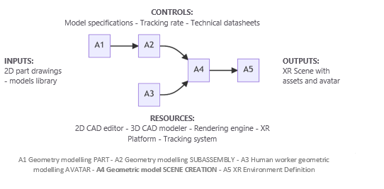
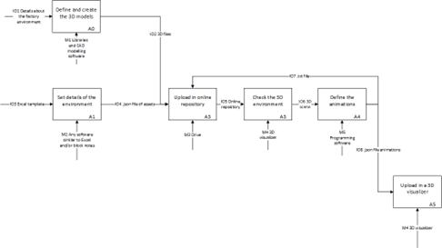
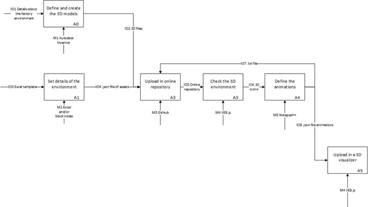
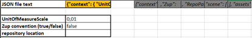
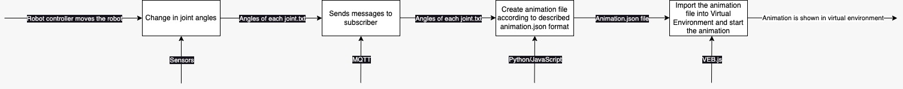

# <a name="_toc230940092"></a>Smart manufacturing laboratory – AVATAR

Practical guide for the development of a VR manufacturing system

<a name="_toc132919656"></a>A.Y. 2022


# Contents
[Smart manufacturing laboratory – AVATAR	1](#_toc230940092)

[Introduction	2](#_toc1070956205)

[Digital tools	3](#_toc234069814)

[MS Excel	3](#_toc477180370)

[GitHub	3](#_toc1053500076)

[Autodesk Inventor	3](#_toc1355406223)

[Notepad++	3](#_toc1799295600)

[VEB.js	3](#_toc33501649)

[JSON	3](#_toc335793070)

[General scheme – IDEF0 diagram	4](#_toc1288832977)

[Creation of an online repository or a local folder	5](#_toc205159316)

[Definition and creation of the 3D models	5](#_toc1868797757)

[How to obtain the 3D models	6](#_toc732024514)

[Conventions	6](#_toc1175578979)

[Shaping the models	6](#_toc2029820077)

[Generation of the 3D environment	6](#_toc968323031)

[Visualization of the 3D environment	8](#_toc1450190346)

[Moving the robot - animations	9](#_toc1477172015)


## <a name="_toc1070956205"></a>Introduction
The aim of this project is to provide a practical guide defining all the steps necessary for the creation of a learning workflow based on VR technologies. All the technical steps are defined, from the creation of a 3D environment to the robot movement. The 3D environment in our case is the CNR laboratory where two COMAU robots are available for testing.

Before starting with the description of the activities, a brief description of the utilized digital tools used in the examples is previously done.
## <a name="_toc234069814"></a>Digital tools
### <a name="_toc477180370"></a>MS Excel
Excel is one of the most know software and thanks to his capabilities we can directly generate a text that will become the .json file. A template of the Excel is provided and the instructions to fill all the cells are provided in the document.

<a name="_toc1053500076"></a>GitHub (https://github.com/)

GitHub is a web and cloud-based service and was born to helps developers store and manage their code and track and control changes. GitHub is used in this project as if it is an online public cloud. This way more people can make changes to the project and VEB.js will be able to access the files online. Using a public repository is free of charge.

<a name="_toc1355406223"></a>Autodesk Inventor (https://www.autodesk.it/products/inventor/overview)

Inventor is a software for 3D modelling. Any kind of 3D modelling software can be used for our purpose (e.g. SketchUp, Solidworks). The software must be able to save files in GLTF/GLB format.  

<a name="_toc1799295600"></a>Notepad++ (https://notepad-plus-plus.org/downloads/)

Notepad++ is a text editor. It is used in this guide since it facilitates the visualization of the elements during programming json files can be opened with notepad++ so that the all the elements of the code can be better understood. This is a free software.

<a name="_toc33501649"></a>VEB.js (https://virtualfactory.gitbook.io/vlft/tools/vebjs)

**VEB.js** (**V**irtual **E**nvironment based on **B**abylon.**js**) is a reconfigurable model-driven virtual environment application. On this application is possible to read and visualize our json files so the factory environment with its assets and animations. Babylon.js library is free to use.
### <a name="_toc335793070"></a>JSON
JSON is an open standard file format and data interchange format that uses human-readable text to store and transmit data objects consisting of attribute-value pairs and arrays (or other serializable values). It is a common data format with diverse uses in electronic data interchange, including that of web applications with servers. JSON is a language-independent data format. It was derived from JavaScript.


## <a name="_toc1288832977"></a>General scheme – IDEF0 diagram
The workflow for creating an XR environment turns out to be much broader than what we will focus on. The complete scheme is shown below. More details can be found at the following link: [Avatar workflows - AVATAR (univ-grenoble-alpes.fr)](https://avatar.gricad-pages.univ-grenoble-alpes.fr/avatar-site/mainchapters/AVATARWorkflows.html).

||<p><br>**CONTROLS:**</p><p>Model specifications - Tracking rate - Technical datasheets</p>| |
| :-: | :-: | :-: |
|**INPUTS:**<br>2D part drawings - models library||**OUTPUTS:**<br>XR Scene with assets and avatar|
| |<p>**RESOURCES:**</p><p>2D CAD editor - 3D CAD modeler - Rendering engine - XR Platform - Tracking system</p>| |

A1 Geometry modelling PART - A2 Geometry modelling SUBASSEMBLY - A3 Human worker geometric modelling AVATAR - **A4 Geometric model SCENE CREATION -** A5 XR Environment Definition

We now focus on the IDEF0 diagram of A4 step. It is a tool developed to describe any kind of workflows. It is composed by different elements described below:

- The square is representing an **activity** that must be completed. Each square is associated with input/output, digital tools and learning objectives.
- The **I/O** represent the necessary materials needed to complete the activity and the expected outcome after completing it.
- **Digital tools** are the software that allow the completion of the activity.

The following image is schematizing the whole process:



Meanwhile, this is specific for the software used in the examples:



Each chapter of this guide describes all the activities shown in the diagram with the relative input/outputs and necessary digital tools. For each of the activities is described the procedure with input/outputs, mechanisms, and the activities necessary to complete them. A practical example is then explained to facilitate the comprehension of the specific argument.

## <a name="_toc205159316"></a>Creation of an online repository or a local folder
There are 2 ways to work with the files that you are going to create: locally or online. The online repository you can use is provided by **GitHub**, this is necessary to store our files and access to them when required from the activities. Online repository is not mandatory, all the files can be also created locally. Anyway, we strongly recommend creating it so the whole team will be able to access it and work simultaneously. Here are the steps to create it.

1. First is necessary to **Sign Up** at the following link: [Join GitHub · GitHub](https://github.com/signup?user_email=&source=form-home-signup)
1. Once registered click, on the top left of the page the green button “New”. 
1. Insert the repository name and a description. Make it public and leave the other options as default.	
1. It is now possible to upload the files by clicking on “Add file” and  “Upload files”.

Here is an example of an already existing repository (is recommended not to modify any file in this repository): [savixy/AVATARrepository: This is a repository for 3D models of the Erasmus+ project AVATAR](https://github.com/savixy/AVATARrepository)
## <a name="_toc1868797757"></a>Definition and creation of the 3D models
The 3D environment must contain all the models that will be involved in the manufacturing process. It is also good to integrate furniture and other elements to make the scene more complete. The objects that will be in the 3D environment are:

- 2 COMAU robots
- 2 robot bases
- 1 conveyor
- 1 tool
- the robot controller
### <a name="_toc732024514"></a>How to obtain the 3D models
Once we have the list of all the necessary objects, we’re going to find them 2 possible ways.

1. First, is possible to exploit **existing models** provided or in online libraries (those can be free to download or with a fee). It is important to mention that the file format of the 3D models must be available in a neutral format (e.g. .STEP or .IGES) so that they can be modified.

The final format to be used in the VR environment must be a .GLB or .GLTF.

1. The 3D models can be **created from scratch** using any CAD software (e.g. Inventor, SketchUP, Solidworks) able to export the files in the previous mentioned formats. This is a more time-consuming way that must be used to create specific models for our environment.
### <a name="_toc1175578979"></a>Conventions
Before going on, be aware that the orientation of each single component must be coherent with the other objects in the scene. In many CAD environments, it is possible to specify the convention used for the orientation of the z-axis (z-up option). The z-up convention is the one that will be also used in our examples (it is anyway possible to use other conventions, be coherent). 

As example, the URDF files uses the following conventions:

- z-up
- Euler angles XYZ extrinsic (corresponding to ZYX intrinsic)

That are different from VEB.js conventions:

- Yup
- Euler angles YXZ intrinsic

More details about the 3D models can be found here: <https://virtualfactory.gitbook.io/vlft/kb/instantiation/3d-models>. 
### <a name="_toc2029820077"></a>Shaping the models
The laboratory structure and the robot already exist, the files are provided in the attached folder *“3D models”*.

The base of the robot, the conveyor and the robot tool must be generated manually. All the measurement necessary to shape the models; controller, conveyor, robot base, tool and their placement in the environment [Zmap] (the unit of measure is millimetres) are in the folder *“Drawings”.* For each of them you can find the dwg files, a PNG file with the measurements and a picture of the robot base and the tool. It is not necessary to define every single detail of the models.
## <a name="_toc968323031"></a>Generation of the 3D environment
Once you have all the models, we can start creating the 3D environment. The steps consist in:

1. Import the files.
1. Place the models in the correct position and orientation depending on the “zmap”. The aim is to: add the base of the robot, under it, add the conveyor in the correct position and attach the tool to the robot.

In the example, this work is supported with the use of an Excel sheet able to generate the .json file that can be read by VEB.js or any other software mentioned in the IDEF0 diagram (e.g. Unreal Engine, Unity).

There is another way that avoid the use of the Excel file that consists in directly modifying the .json file.

**Excel file template**

The file template can be found in the folder “” and is named “Excel\_Template”. The sheet *“assets”* have all the details about the single 3D models in the environment. The sheet *“context”* has 4 cells of our interest:

- **JSON file text:** the text inside this cell is providing us the code for the .json file. By copying it in a .txt file and changing the format in .json we are able to create our .json file.
- **UnitOfMeasureScale:** this is the unit of measure 0,01 for centimetres, 1 for meters.
- **Zup convention:** VEB.js use the Yup convention. It is important to be aware of the convention used in the 3D visualizer.
- **Repository location:** path where the 3D models can be found. This is not mandatory since in the VEB.js link we are going to refer again to this repository.



More details can be found at the following link: <https://virtualfactory.gitbook.io/vlft/kb/instantiation/assets/spreadsheet>

Once the Excel file is completed with all the details, the json file can be created by copying the B1 cell of the sheet “context”.


**Json code**

The modifying of the .json code is a bit more complex than the use of the Excel file but allow to have a higher control over the written code. This can be done using any text software.

An already existing .json file with the laboratory structure and the robot can be found in the folder “files” and is named “Original.json”. 

It is important to mention that the position and orientation must be checked multiple times in the 3d environment to be sure the model is in the expected place (the way to visualize the online environment is described in the next chapter).

Let’s see the new code defined for adding the conveyor:

```
{
              "id": "Conveyor", ← This is reference id.
              "type": "https://w3id.org/ontoeng/factory#Conveyor", ← This is the type of asset, all the types can be found in the file "factory.owl".
              "representations": [
                    {
                      "file": "Conveyor.glb", ← The name of the 3D model in the repository
                      "unit": 1
                    } 
              ], 
              "position": [
                  4, 
                  0, ← XYZ position of the asset
                  -1 
              ], 
              "rotation": [ 
                  0, 
                  0, ← Intrinsic rotation around XYZ
                  0 
              ] 
         }
```

The same code can be used to insert all the other models.
## <a name="_toc1450190346"></a>Visualization of the 3D environment
This chapter of the document is extremely important since it allow us to check visually if the models are positioned correctly and if the robot is working as expected. 

**Creating a scene**

Before importing the models, it is possible to define the environment. The latter consist in adding cameras and lights. More information can be found at the following link: <https://virtualfactory.gitbook.io/vlft/tools/vebjs/input-output>. To automatically import the environment the relative file name must \*nameofthescenefile\_env.json\*be and must be in the same folder of the scene file.

Once you have created the online repository with the scene (.json) file and the environment file, or you have them locally you are ready to visualize it in the 3D VEB.js (or any other software) environment.

In case you have them **locally**, open VEB.js (link: https://ec2-54-174-51-194.compute-1.amazonaws.com/vebjs/?inputscene=&repoMod3d=) and click on import scene, select your .json file. You should now be able to see the 3D environment.

If you’re using VEB.js you can move the camera using “q-w-e-a-s-d” buttons.

If you have them **online**, you need to modify the following link accordingly to your username and the name of the repository:

http://ec2-54-174-51-194.compute-1.amazonaws.com/vebjs/?inputscene=https://raw.githubusercontent.com/
**\*username\*/\*name-of-the-repository\***/main/scenes/**\*name-of-the-json-file.json\***
&repoMod3d=https://raw.githubusercontent.com/**\*username\*/\*name-of-the-repository\***
/main/models/

The words in bold must be modified with the respective reference words.
## <a name="_toc1477172015"></a>Moving the robot - animations
**Dataflow between the real system and its digital twin represented in the virtual factory environment:**

1\. The robot's joint states are measured using sensors or other monitoring systems, providing information about the angles and positions of each joint.

2\. The joint states data is then transmitted to an MQTT broker acting as a publisher. This approach allows the same mechanism to be used for both publishing data related to the movements of a real robot or emulating a robot while exploiting a predefined trajectory.

3\. The MQTT broker sends the joint states data, which includes the angles of each joint, to a subscriber, which collects the data for further processing.

4\. The subscriber then processes the collected data, converting it to a neutral data format that can be used to create animations. This involves developing Python/JavaScript routines to transform the data into JSON format, which can be used to create animations that represent the robot's movements.

5\. The resulting animations in JSON format are sent to the digital twin of the robot in the virtual factory environment.

6\. The digital twin uses the received animations to simulate the robot's movements in the virtual factory environment. 

This data flow ensures that the robot's movements are accurately represented in the virtual factory environment, even though the data provided by the robot only includes joint states rather than the actual position of the end effector. By using MQTT messaging and Python/JavaScript routines to convert and process the data, the digital twin's software system can create animations that accurately represent the robot's movements.

Overall, this data flow allows for the accurate simulation of the real robot's movements in the virtual factory environment, based on the joint states data provided by the real system.



**JSON file for animation:**

This JSON schema is used for defining animations in a factory model. The schema has three root properties: "context," "nodes," and "sequences." The "context" property includes several optional properties, including the unit of measure scale, the repository path where 3D models and animation sequences can be found, and Boolean values to determine whether asset trails should be displayed and the conventions (zup or yup) for the 3-D cartesian coordinate system. The "nodes" property includes an array of items, each of which represents an asset in the model and has an "id" property and an "actions" array that specifies what happens during the animation. The "sequences" property also includes an array of items, each of which represents an animation sequence and has an "id" property, a frames per second value, and arrays of positions, rotations, and scales for each frame. The schema is designed to be easy for humans and machines to read and write.

More details about format of JSON file that defines animation can be found at the following link: https://virtualfactory.gitbook.io/vlft/kb/instantiation/animations

**A bit further explanation of how a robot might send messages about its joint angles via MQTT to a computer:**

MQTT (Message Queuing Telemetry Transport) is a lightweight, publish-subscribe messaging protocol that is commonly used in the Internet of Things (IoT) and other applications. In the case of a robot, the joint angles are likely to be measured by sensors or encoders that are attached to the robot's joints. These sensors can generate data at a high rate, potentially several times per second or even faster, depending on the specific application and the performance requirements. To send this data to a computer, the robot might use MQTT to publish messages containing the joint angle data. The robot would first connect to an MQTT broker, which is a server that acts as a hub for the communication between the robot and the computer. Once connected, the robot would publish messages to the broker, which would then forward the messages to any subscribed clients, such as the computer. The messages themselves would typically contain joint name and joint angle as key value pairs that can be easily parsed by the computer. Each message also contains a timestamp indicating when the data was collected. The frequency at which the robot publishes these messages would depend on the application, but it could be several times per second in order to provide real-time feedback to the computer.


